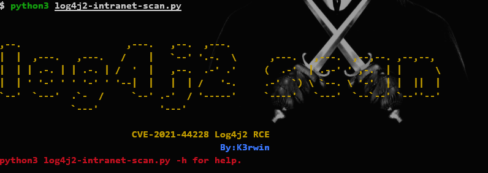
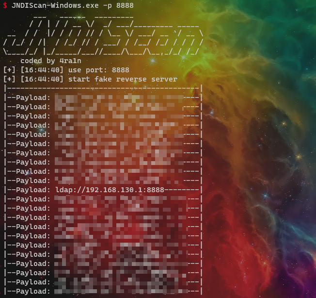
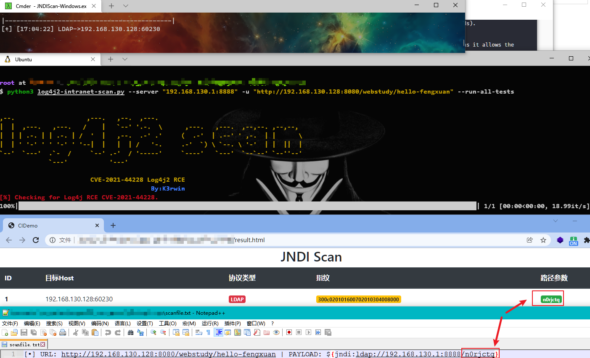
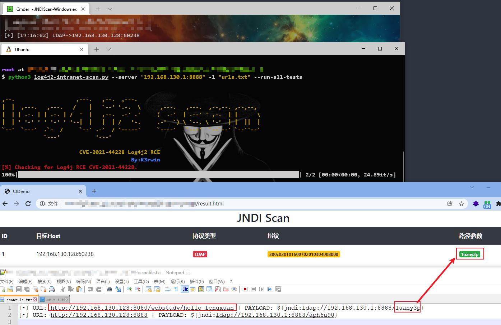

# Log4j2-intranet-scan



## ⚠️免责声明

---

>本项目仅面向合法授权的企业安全建设行为，在使用本项目进行检测时，您应确保该行为符合当地的法律法规，并且已经取得了足够的授权
>
>如您在使用本项目的过程中存在任何非法行为，您需自行承担相应后果，我们将不承担任何法律及连带责任
>
>在使用本项目前，请您务必审慎阅读、充分理解各条款内容，限制、免责条款或者其他涉及您重大权益的条款可能会以加粗、加下划线等形式提示您重点注意
>
>除非您已充分阅读、完全理解并接受本协议所有条款，否则，请您不要使用本项目
>
>您的使用行为或者您以其他任何明示或者默示方式表示接受本协议的，即视为您已阅读并同意本协议的约束

----

## 1.Features(特性)

- 该项目是一款无须借助`dnslog`且完全无害的`JNDI`反连检测工具，解析`RMI`和`LDAP`协议实现，可用于甲方内网自查

- Support for lists of URLs.
- Fuzzing for more than 60 HTTP request headers (not only 3-4 headers as previously seen tools).
- Fuzzing for HTTP POST Data parameters.
- Fuzzing for JSON data parameters.
- WAF Bypass payloads.

---

## 2.Installation(安装)

```
$ pip3 install -r requirements.txt
```

---

## 3.Usage(Jndi监听和记录)

### win

```shell
JNDIScan-Windows.exe -p 8888
```

### Linux

```shell
./JNDIScan-Linux -p 8888
```

### Mac

```shell
./JNDIScan-Darwin -p 8888
```



---

## 4.Usage(扫描)

>需要配合jndi监听和记录工具使用，--server参数为 jndi监听的内网ip及端口

```shell
$ python3 log4j2-intranet-scan.py -h
usage: log4j2-intranet-scan.py [-h] [-u URL] [-c CRAW] [-p PROXY] [-l USEDLIST] [--request-type REQUEST_TYPE]
                               [--headers-file HEADERS_FILE] [--run-all-tests] [--exclude-user-agent-fuzzing]
                               [--wait-time WAIT_TIME] [--waf-bypass] [--test-CVE-2021-45046] [--server SERVER]
                               [--disable-http-redirects]

optional arguments:
  -h, --help            show this help message and exit
  -u URL, --url URL     Check a single URL. example('http://vultest.com/test.jsp')
  -c CRAW, --crawler CRAW
                        use crawler,any values,like 1
  -p PROXY, --proxy PROXY
                        send requests through proxy
  -l USEDLIST, --list USEDLIST
                        Check a list of URLs.
  --request-type REQUEST_TYPE
                        Request Type: (get, post) - [Default: get].
  --headers-file HEADERS_FILE
                        Headers fuzzing list - [default: headers.txt].
  --run-all-tests       Run all available tests on each URL.
  --exclude-user-agent-fuzzing
                        Exclude User-Agent header from fuzzing - useful to bypass weak checks on User-Agents.
  --wait-time WAIT_TIME
                        Wait time after all URLs are processed (in seconds) - [Default: 5].
  --waf-bypass          Extend scans with WAF bypass payloads.
  --test-CVE-2021-45046
                        Test using payloads for CVE-2021-45046 (detection payloads).
  --server SERVER       ldap_server
  --disable-http-redirects
                        Disable HTTP redirects. Note: HTTP redirects are useful as it allows the payloads to have
                        higher chance of reaching vulnerable systems.
```

### Scan a Single URL

```shell
$ python3 log4j2-intranet-scan.py --server "192.168.130.1:8888" -u "https://vultest.com/login.jsp" --run-all-tests --crawler
```

>--server 指定ldap服务地址
>
>-u 指定扫描url
>
>--run-all-tests 使用get、post、json三种方式进行探测
>
>-c  使用crawler进行子页面爬取，爬取深度为2层，

### Scan a list of URLs

```shell
$ python3  log4j2-intranet-scan.py --server "192.168.130.1:8888" -l "urls.txt" --run-all-tests --crawler
```

> --server 指定ldap服务地址
>
> -l 指定扫描url文件
>
> --run-all-tests 使用get、post、json三种方式进行探测
>
> --crawler  使用crawler进行子页面爬取，爬取深度为2层，

### Scan a Single URL using all Request Methods: GET, POST (url-encoded form), POST (JSON body)


```shell
$ python3 log4j2-intranet-scan.py --server "192.168.130.1:8888" -u https://vultest.com/login.jsp --run-all-tests
```

### Discover WAF bypasses on the environment.

```shell
$ python3 log4j2-intranet-scan.py --server "192.168.130.1:8888" -u https://vultest.com/login.jsp --waf-bypass
```

## 5.Example(演示)

>监听结果存储在当前文件夹下的`result.html`文件中,查看路径参数在批量扫描中可以定位到存在漏洞的`uri`，需要配合扫描生成的`scanfile.txt`中的随机路径参数使用

### Single URL



### Urllist



---

## 6.reference(参考/致谢)

>站在巨人的肩膀上coding，该项目部分工具和代码来自以下两个项目

[log4j-scan](https://github.com/fullhunt/log4j-scan)

[JNDIScan](https://github.com/EmYiQing/JNDIScan)

---

## 7.docker(靶场)

靶场环境来自雷石安全实验室

```shell
docker pull registry.cn-hangzhou.aliyuncs.com/fengxuan/log4j_vuln
docker run -it -d -p 8080:8080 --name log4j_vuln_container registry.cn-hangzhou.aliyuncs.com/fengxuan/log4j_vuln
docker exec -it log4j_vuln_container /bin/bash
/bin/bash /home/apache-tomcat-8.5.45/bin/startup.sh
```

